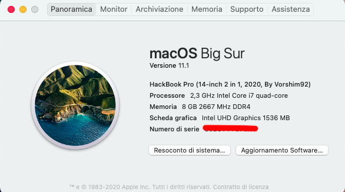

# DELL Inspiron 5491 2in1 (Comet Lake) Hackintosh

EFI for Dell Vostro 5491 with OpenCore bootloader

### Computer Spec:

| Component        | Brank                              |
| ---------------- | ---------------------------------- |
| CPU              | Intel i7 10510U (4C-8T 8MB CML)    |
| iGPU             | Intel® Graphics Graphics UHD       |
| Audio            | Realtek ALC236                     |
| Ram              | 8 GB DDR4 2666 Mhz (TEMP)          |
| Wifi + Bluetooth | Intel AC9462 (BCM94360NG Fenvi incoming)|
| NVMe             | Toshiba KYOXIA 512 GB (MACOS)         |
| SmBios           | MacBookPro 16,3                    |
| BootLoader       | OpenCore 0.6.6                     |
| macOS            | Big Sur 11.1                       |

### What works and What doesn't or WIP:

- [x] Intel Graphics UHD iGPU 
- [x] Intel Graphics UHD iGPU HDMI Output
- [x] IIntel Graphics UHD iGPU Type-C to HDMI Output
- [x] ALC236 Internal Speakers
- [ ] ALC236 Internal microphone
- [x] USB MINI Dongle Microphones (TEMP)
- [x] ALC236 Combojack headphones
- [ ] ALC236 Combojack microphone (FIX INCOMING)
- [x] ALC236 HDMI Audio Output
- [x] ALC236 TYPE-C to HDMI Audio Output
- [x] All USB-A 3.1 Ports (TYPE-C 3.2 Included)
- [x] SpeedStep / Sleep / Wake
- [x] HID Key PWRB & SLPB 
- [x] I2C Touch pad with gesture
- [x] I2C Touch Screen
- [x] Keyboard (PS2-Internal) with backlight
- [x] F6 & F7 Brightness Key
- [x] F10 Print Screen Key
- [x] F1 & F2 & F3 Sound Key
- [x] Wi-Fi and Bluetooth BCM94360NG Module
- [x] Controller SATA III
- [x] Controller NVME PciE Gen3x4 
- [x] Micro SD Cardreader (USB-Internal)
- [x] WebCam (USB-Internal)
- [x] All Sensors CPU, IGPU, BATTERY, NVME, SATA, FAN
- [x] ACPI Battery
- [x] Apple VTD
- [x] NVRAM (Native)
- [x] Recovery (macOS) boot from OpenCore
- [x] Windows 10 boot from OpenCore

## Peripherals & TouchPad Setting & Benchmarks

### PERFORMANCE INTEL POWER GADGET

### Special Config:

- Usb port mapping performed
- SSDT-Hack Essential patch
- Applied cosmetics PCI Dev

See [ioreg](./IOREG%20MacbookPro16,2.ioreg) for more clarification

## Bios settings for Bios Version F.21
### Enable :
* Fastboot : Enable

### Disable : 
* Secure Boot
* TPM2.0 Security On
* Intel SGX
* VT for Direct I/O
* CFG-lock and DVMT: DO AT YOUR OWN RISK!!! It may brick your laptop.

 
 
 
Create a usb in FAT with MBR map and put [ru.efi](./TOOLS%20EFI%20MOD/RU.efi) in it 
then go to the bios, and create an entry with the path of the usb and setting the ru.efi file and the name of 
your choice startup and then send and finally click apply.

Restart and press f12 among the entries you will have the last created, click any key, then click alt + ì a menu will appear and
scroll to CpuSetup and click enter, in the new screen go with the arrows on the value 0043 and change it from 01 to 00 and click 
enter and then ctrl + w to save and then alt + q to exit. proceed to check if your CFG LOCK is unlocked.

For the 2 DVMT values you have to go to the SaSetup menu and enter and look for 00A4 and set it from 02 to 05 and then move 
next to 00A5 and set from 02 to 03 then save with ctrl + w and to exit alt + q and you will have the suitable DVMT values to the igpu ice lake. 

## Credits

- [Apple](https://apple.com) for macOS.
- [Acidanthera](https://github.com/acidanthera) for OpenCore and all the lovely hackintosh work.
- [Dortania](https://dortania.github.io/OpenCore-Install-Guide/config-laptop.plist/icelake.html) For great and detailed guides.
- [Hackintoshlifeit](https://github.com/Hackintoshlifeit) Support group for installation and post installation.
- [Lorys89](https://github.com/Lorys89) a special thanks for everything about hackintosh! 

# If you need help please contact us on [Telegram](https://t.me/HackintoshLife_it) or [Web](https://www.hackintoshlife.it/)
